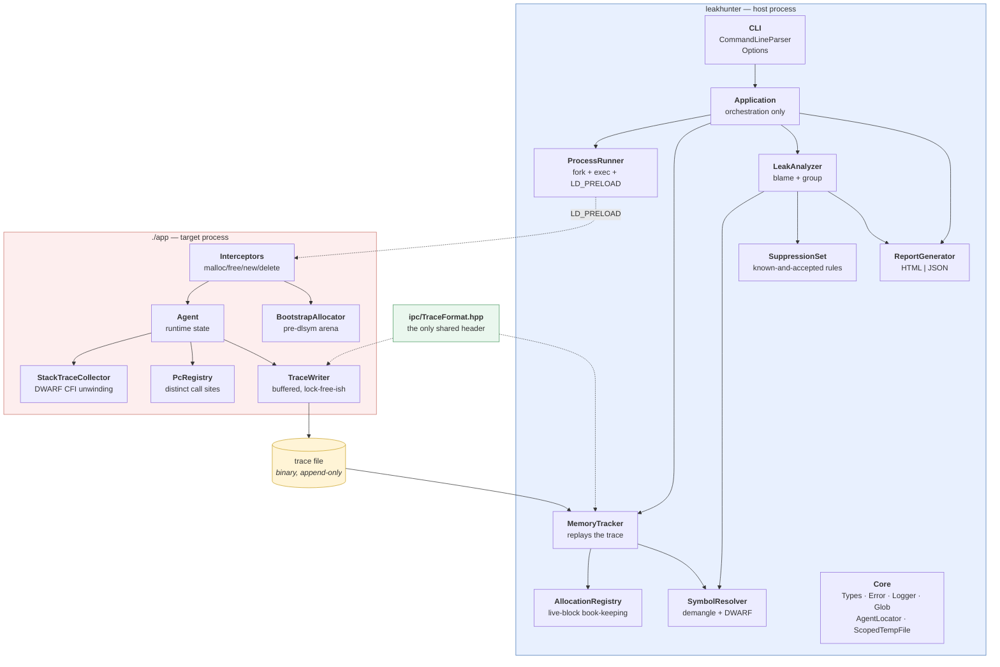
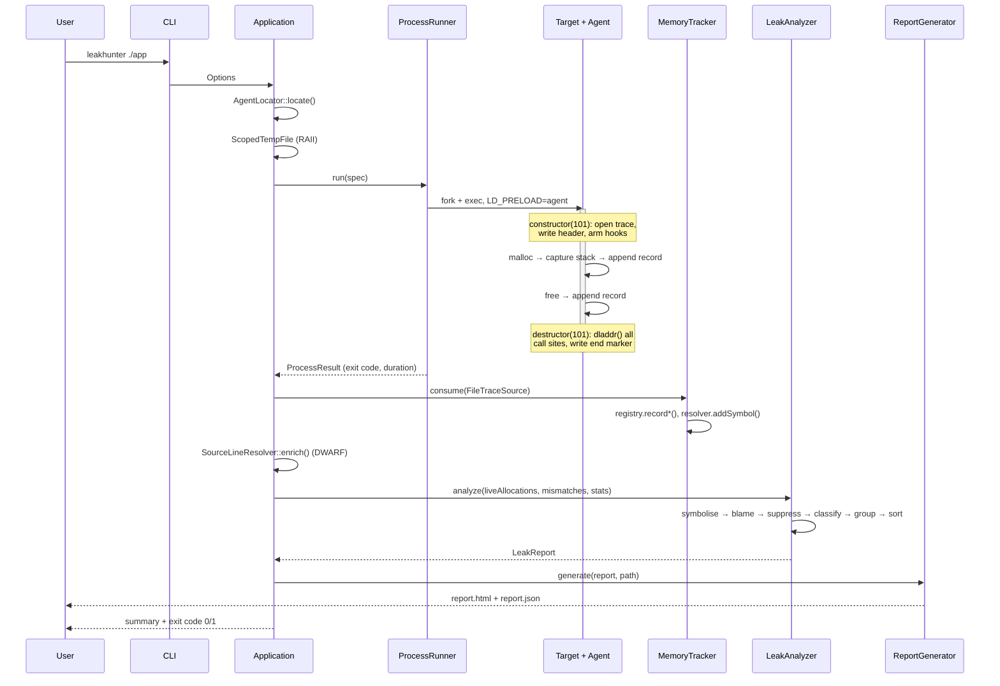

# Architecture

## The central constraint

LeakHunter runs inside somebody else's process, underneath their allocator. The code that
intercepts `malloc` **cannot itself call `malloc`** — doing so recurses until the stack is gone.
It also cannot use `std::vector`, `std::string`, `std::mutex`, iostreams, or exceptions on any hot
path, because all of them may allocate.

That constraint would make the whole codebase unpleasant if it applied everywhere. So it does not:

> **LeakHunter is split into two halves that never share code.**
> The *agent* is injected into the target and does the minimum possible: intercept, capture, append
> bytes to a file. The *host* is an ordinary C++20 program that reads that file afterwards and does
> all the analysis with the full standard library.

Everything else in this document follows from that split.

---

## Component diagram



The two subgraphs share exactly one header: `include/leakhunter/ipc/TraceFormat.hpp`, which
contains only POD structs and `<cstdint>`. Nothing else crosses the boundary.

---

## Module responsibilities

| Module | Responsibility | Must not |
|---|---|---|
| **CLI** | Turn `argv` into a validated `Options` | know about tracing |
| **Application** | Wire modules together, own the sequence | contain analysis logic |
| **ProcessRunner** | Launch the target, inject `LD_PRELOAD` and its identity, wait | know about leaks |
| **MemoryTracker** (host) | Replay trace records, route them | interpret them |
| **AllocationRegistry** | Decide what is still live, and pair alloc/free entry points | know about symbols |
| **StackTraceCollector** (agent) | Walk the stack, no allocation | allocate |
| **SymbolResolver** | Address → function/file/line | know about leaks |
| **LeakAnalyzer** | Blame a frame, group, sort, filter | do I/O |
| **SuppressionSet** | Parse rules, match a stack against them | know what a leak *is* |
| **ReportGenerator** | Render one format | change the data |
| **Core** | Shared value types and utilities | depend on anything above |

Dependencies point strictly downward. `AllocationRegistry` does not know `SymbolResolver` exists;
`LeakAnalyzer` receives a resolver through `ISymbolResolver` and never constructs one. That is what
lets the unit tests drive the analyzer with a fake resolver and no files on disk.

---

## Execution flow



---

## Why a trace file instead of shared memory or a pipe

A pipe would deadlock: the host is blocked in `waitpid` while the child fills the pipe buffer, and
neither side moves. Fixing that needs a reader thread and a protocol for partial reads.

Shared memory needs a ring buffer, a consumer that keeps up, and a policy for what happens when it
does not.

A file needs none of that. The child appends, the parent reads after exit, and a target that was
`SIGKILL`ed still leaves every record that was flushed — which is the case you most want data for.
The cost is disk space proportional to allocation count; `--max-frames` is the dial for that, and
streaming is on the [roadmap](ROADMAP.md) for long-running services.

---

## The hard parts, and how they are handled

### 1. Resolving `malloc` requires `dlsym`, and `dlsym` calls `malloc`

The first call into our `calloc` hook happens *while* we are trying to find the real `calloc`.

`BootstrapAllocator` is a bump allocator over a 128 KiB BSS array. When the real function is not
resolved yet, allocations are served from it. Blocks are never reused and never freed; `free()`
recognises them by address range and ignores them. The loader needs a few kilobytes.

A thread-local `t_resolving` flag breaks the recursion inside `dlsym` itself.

### 2. Recording an allocation allocates

Unwinding and writing can both call `malloc`. `HookGuard` is a thread-local depth counter: only
the outermost entry on a thread records anything. Inner re-entries pass straight through to the
real allocator.

```
user code → malloc          depth 0 → 1, engaged   → record
  libunwind → malloc        depth 1 → 2, passive   → no record
    writer  → malloc        depth 2 → 3, passive   → no record
```

The counter is `thread_local` with `tls_model("initial-exec")`, so reading it never calls
`__tls_get_addr` — which could itself allocate on first access.

### 3. Symbolisation must happen inside the target

Only the target's dynamic loader can map an address to a module. But calling `dladdr` from inside
`malloc` risks deadlocking against the loader's own lock.

`PcRegistry` splits it in two: a fixed-size, lock-free open-addressing set records *which*
addresses were seen (cheap, no allocation, bounded probe count), and `dladdr` runs over the whole
set at shutdown, when the loader lock is free and tracing is already disabled.

### 4. Choosing an unwinder

`StackTraceCollector` has two back-ends behind one function. The default is `_Unwind_Backtrace`
from the compiler runtime; libunwind is opt-in via `-DLEAKHUNTER_WITH_LIBUNWIND=ON`.

That ordering is measured, not assumed. Both read the same DWARF CFI and produce byte-identical
attribution on every example in this repository, but on the benchmark here (glibc 2.39, libunwind
1.6.2, x86-64):

| Workload, 8 frames | `_Unwind_Backtrace` | libunwind |
|---|---:|---:|
| 1M allocations, 1 thread | 1.24 s | 7.16 s |
| 2M allocations, 8 threads | 2.45 s | 8.54 s |

Since unwinding dominates tracing cost, a 3–6x difference for identical output decides it.
`unw_set_caching_policy(UNW_CACHE_PER_THREAD)` was tried on the theory that libunwind's global
cache lock was serialising threads; it changed nothing (8.54 s with, 8.45–8.66 s without) and was
not kept. libunwind remains available because it handles cases the compiler runtime does not —
signal frames and JIT-registered unwind info.

### 5. `dladdr` cannot see `static` functions

They never reach the dynamic symbol table, so most application frames come back nameless. The host
then runs `llvm-symbolizer` (or `addr2line`) over the module-relative offsets to recover both the
function name and `file:line` from DWARF. dladdr's answer always wins where it exists; DWARF only
fills gaps.

For non-PIE objects the module-relative offset is wrong and the absolute address is right. Rather
than guessing which kind of object it is, the resolver retries the failures with the absolute
address.

### 6. The agent object must exist before any code runs

A function-local static needs a guard variable and could be constructed *after* first use. A
namespace-scope object with a dynamic initialiser has undefined order relative to libc.

`Agent` therefore has no constructor and no destructor: every member is trivially constructible,
the instance is `constinit` and lives in BSS, and `initialize()` / `shutdown()` are called
explicitly from `__attribute__((constructor(101)))` and `((destructor(101)))`. Priority 101 is the
earliest a user library may request, and destructors run in reverse priority order — so the agent
starts before the program's static initialisers and stops after their destructors.

### 7. `fork()` in the target

A child could inherit a mutex locked by a thread that does not exist there. `pthread_atfork`
locks the writer before the fork and unlocks it after, in both processes.

The child then **stops tracing**: two processes appending partial buffers to one file would corrupt
it. Only the top-level process is recorded — see the [roadmap](ROADMAP.md).

**Clearing the "am I tracing" flag is not enough, and for a long time that was the whole handler.**
Two more things cross `fork()`:

| Inherited | Consequence |
|---|---|
| a **copy of the write buffer**, still holding the parent's unflushed records — *including the file header* | anything that flushes in the child writes a second copy of all of it |
| the **same open file description** | parent and child share one file *offset*, so every byte the child writes pushes the parent's next flush further into the file |

The child does not have to record anything to do damage. The interposed `_exit()` calls
`emergencyFlush()`; a fatal signal does the same. Either one writes the parent's records again, at
the shared offset. The resulting file was:

```
[parent's header][8 module records][50 allocations]   ← written by the CHILD's flush
[parent's header][100 allocations][symbols][end]      ← written by the PARENT, at the shared offset
 ^
 the host reads from 0, gets 50 allocations, hits a second magic number,
 treats it as an unknown record type, and stops. No end marker.
```

Measured on a program that leaks 100 blocks around a `fork()`: **50 reported**.

`TraceWriter::abandonInChild()` fixes it by severing the connection instead of just muting it — the
child discards its buffer copy *unwritten* and closes its own descriptor (which leaves the parent's
untouched, since only the descriptor goes away, not the file description). The discarded bytes are
deliberately **not** counted as dropped: they still live in the parent's buffer, and counting them
would make the parent's own trace claim to be incomplete.

This covers a bare `fork()`, where the child keeps the same image. `fork()` followed by `exec()`
replaces the image and re-runs the agent's constructor from scratch, wiping the handler's decision
along with everything else — that is section 10.

### 7b. A target that closes the trace descriptor

```c
for (int fd = 3; fd < 256; ++fd) { close(fd); }
```

That is the standard way for a daemon to shed inherited descriptors, and it closed ours. Writes then
failed with `EBADF`, the trace ended wherever the program happened to be, and a program that closed
its descriptors early produced an *empty* trace — which the host reported as "it may be statically
linked". Confidently, and wrongly, about a dynamically linked program that had allocated a thousand
times.

Two changes, because neither is sufficient alone:

- **Sit above the loop.** After opening, the descriptor is moved above 512 with
  `fcntl(F_DUPFD_CLOEXEC)`. Hard-coded `close()` loops almost always stop at 256 or 1024, so this
  makes the common form harmless. It is mitigation, not a guarantee.
- **Name the failure when it happens anyway.** `close_range(3, ~0U)` and `closefrom()` still take
  the descriptor. The writer now keeps the `errno` that broke it, and the agent prints an
  explanation on stderr at shutdown — unconditionally, not only under `--verbose`, because the trace
  is incomplete and the host cannot work out why on its own. The host's own message lists the three
  possible causes instead of asserting one, and says that an agent message takes precedence.

### 8. Targets that die without shutting down

The symbol table and the end marker are written by the library destructor. A `SIGSEGV`, a
`SIGKILL`, or an `_exit()` never gets there — and a crashing program is exactly when someone
reaches for a leak detector. With a 1 MiB write buffer, a program that allocated a few hundred
blocks and then crashed originally produced an *empty* trace: total loss.

Three things make that case work:

1. **A fatal-signal handler** (`SIGSEGV`, `SIGBUS`, `SIGILL`, `SIGFPE`, `SIGABRT`, `SIGTERM`,
   `SIGINT`) flushes the buffer and re-raises. `SA_RESETHAND` means the re-raise hits the default
   disposition, so the process dies exactly as it would have: same exit status, same core dump.
   The handler is installed from the library constructor, so any handler the target installs later
   wins — we would rather lose the flush than change the program's behaviour.

2. **`_exit` and `_Exit` are interposed** to flush before passing through, since they bypass every
   destructor and `atexit` handler by design.

3. **The module map is written at start-up**, not at shutdown. This is the part that makes the
   recovered data *useful*. `dladdr` is not async-signal-safe, so a crash loses the symbol table
   entirely — and without it every leak used to become its own anonymous group. The map produced by
   `dl_iterate_phdr` at start-up lets the host turn any raw address into `(module, offset)`, which
   is all the DWARF pass needs. A crashed target now reports the same function names and line
   numbers as a clean one.

The flush deliberately does **not** take the writer mutex: `pthread_mutex_lock` is not
async-signal-safe, and the thread holding it may be the one that just died. Risking one torn record
at the very end is the right trade against deadlocking and losing everything.

One trap worth recording: `dl_iterate_phdr` reports the main executable with an empty name, and the
obvious substitute — `/proc/self/exe` — is wrong. The host reads the trace in a *different*
process, where that path points at `leakhunter` itself. It must be resolved with `readlink` inside
the target, while "self" still means the target.

### 9. `realloc` failure

`realloc` leaves the original block valid when it fails. Recording the free unconditionally would
turn a live block into a phantom leak later, so the free is only recorded when the call actually
succeeded (or shrank to zero).

### 10. A child process that destroys the parent's trace

Everything the agent needs arrives through the environment, and **every environment variable
survives `exec()`**. So when a traced program `fork()`s and `exec()`s something, the child's copy of
the agent starts up with the same `LEAKHUNTER_TRACE` path — and opens it with `O_TRUNC`.

The consequences are as bad as they sound, and they are quiet:

1. the child truncates away every record the parent has already flushed;
2. the child writes its own file header, its own records, its own symbol table and its own end
   marker, starting at offset 0;
3. the parent's later flushes land at *its* file offset, which is now far into the file;
4. the host reads from offset 0, finds the child's header, reads the child's records, hits the
   child's end marker and stops — reporting **the child's allocations under the child's pid**, with
   `droppedRecords` at zero.

Measured on `cmake` configuring a trivial project: **1,356 allocations reported out of 178,442**.
On a purpose-built reproducer that flushed before forking: 200 leaks reported out of 40,100, and the
200 belonged to the child.

Worse, it *looked* fine in the easy case. If the parent's 1 MiB buffer never fills, it flushes last,
at offset 0, and its end marker terminates the host's read — so small single-fork programs gave
exactly the right answer, by luck. The bug only appeared once the parent was busy enough to flush
before forking, which is precisely when someone reaches for a leak detector.

The fix is process identity. `PosixProcessRunner` fills a reserved `LEAKHUNTER_PID` slot in the
child's environment **after `fork()`** — the first moment the traced process's own pid exists — and
the agent compares it against `getpid()`:

```
host: fork() ──▶ child: envp[pidSlot] = "LEAKHUNTER_PID=4120" ──▶ exec(target)
                                                                    │
target (pid 4120): LEAKHUNTER_PID == getpid()  ──▶ trace
  └─ its child (pid 4123): LEAKHUNTER_PID != getpid() ──▶ stay passive
```

The formatting is hand-rolled rather than `snprintf`, because between `fork()` and `exec()` only
async-signal-safe operations are guaranteed — and it is unit-tested, since a bug there reintroduces
exactly the failure it prevents.

Two smaller things fell out of the fix. The host now refuses to write a report whose trace header pid
does not match the process it launched, as a backstop rather than a primary defence. And traces got
dramatically smaller for spawning targets: `g++ -c` went from a 30 MB trace (almost all of it
orphaned child data that was written and never read) to 58 KB.

### 11. Mismatched frees, and the one configuration that fakes them

Pairing "how was this allocated" with "how was it released" is nearly free: `AllocKind` was already
in every allocation record, and the deallocation record's header had a spare `kind` byte doing
nothing. Filling it in makes `new[]` released with `delete` visible at zero run-time cost, with no
extra stack capture — the allocation stack, which the registry is already holding, is what a
developer needs to fix it.

The trap is the **dynamic linker's search order**. Preloaded objects come *after* the executable
itself, not before. So a program that links a static libstdc++, or defines its own global
`operator delete`, keeps its own definition — and if that definition calls `free()`, then every
single correct `new`/`delete` pair in the program arrives here looking like a `new` released with
`free()`. On a program doing 500 correct pairs, that is a 500-finding report with nothing real
in it.

The defence is a consistency check rather than a heuristic: require that either **both** halves of
the C++ pair were observed, or **neither**.

```
new observed?   delete observed?   verdict
      no               no          trust (a C program; no pairing to get wrong)
     yes              yes          trust (our interposition covers both sides)
     yes               no          suppress (our operator delete is not the one being called)
      no              yes          suppress (our operator new is not the one being called)
```

Seeing exactly one half is proof that the interposition is one-sided, and every pairing derived
from it would be an artefact. The cost is one false negative — a program whose *only* C++
allocation is the buggy one — which is a fair trade for removing both false-positive floods.

The state is then reported rather than hidden: `summary.mismatchDetection` is `active`,
`suppressed` or `disabled`, because "zero mismatched frees" means something very different in each
case, and a report that does not distinguish them is lying by omission.

Validated against `ls`, `grep`, `sed`, `git`, `g++`, `cmake`, `python3` and LeakHunter itself:
~9,300 allocations, zero findings. And against a purpose-built program that defines
`operator delete` but not `operator new`: 500 correct pairs, zero findings, check reported as
`suppressed`.

---

## Report attribution

The captured stack of a leak looks like this:

```
 [0] operator new                 libleakhunter_agent.so   ← agent, skipped
 [1] std::vector<T>::_M_realloc   app                      ← candidate
 [2] Cache::insert                app
 [3] main                         app
```

`LeakAnalyzer::findResponsibleFrame` walks outward past agent frames, allocator names
(`malloc`, `operator new`, …) and C runtime modules, and blames the first frame that is left.
Leaks are then grouped by `(function, module)` so the report reads as *"`Cache::insert` leaked
4 MiB across 1024 allocations"* rather than as a thousand separate addresses.

`classifyOrigin` uses the same walk for a different question: if the frame that actually requested
the memory lives in libc or the loader, the block belongs to the C **runtime** (a stdio buffer, a
locale table) and is counted separately rather than listed. This is the difference between a tool
people trust and one they learn to ignore — `printf` alone accounts for a 4 KiB "leak" in every
program ever written.

---

## Directory layout

```
LeakHunter/
├── CMakeLists.txt
├── cmake/                      # dependency resolution, FindLibunwind, warnings
├── include/leakhunter/
│   ├── analysis/               # ILeakAnalyzer, LeakAnalyzer, LeakReport, SuppressionSet
│   ├── app/                    # Application
│   ├── cli/                    # Options, CommandLineParser
│   ├── core/                   # Types, Error, Logger, Glob, AgentLocator, ScopedTempFile
│   ├── ipc/                    # TraceFormat.hpp  ← the agent/host contract
│   ├── process/                # IProcessRunner, PosixProcessRunner
│   ├── registry/               # IAllocationRegistry, AllocationRegistry
│   ├── report/                 # IReportGenerator, Html/Json generators
│   ├── symbols/                # ISymbolResolver, SymbolResolver, SourceLineResolver
│   └── tracker/                # ITraceSource, FileTraceSource, MemoryTracker
├── src/
│   ├── agent/                  # ← the injected library; no STL on hot paths
│   │   ├── Agent.cpp           #   runtime state + lifecycle
│   │   ├── Interceptors.cpp    #   the interposed symbols
│   │   ├── BootstrapAllocator  #   pre-dlsym arena
│   │   ├── StackTraceCollector #   libunwind / _Unwind_Backtrace
│   │   ├── PcRegistry          #   distinct call sites
│   │   ├── RealFunctions       #   dlsym(RTLD_NEXT, ...)
│   │   └── TraceWriter         #   buffered writer
│   ├── analysis/ app/ cli/ core/ process/ registry/ report/ symbols/ tracker/
│   └── main.cpp
├── tests/
│   ├── support/                # ~100-line test harness, no dependency
│   ├── unit/                   # registry, CLI, analyzer, reports, wire format
│   └── integration/            # run_case.cmake — real CLI, real agent, real programs
├── examples/                   # one program per leak shape
├── poc/                        # docindex: a realistic demo with four planted defects
└── docs/
```

## Testing strategy

**Unit tests** cover the host modules in isolation. The analyzer is driven by a fake
`ISymbolResolver` so tests describe stacks in terms of function names, not fabricated addresses.
The wire format is tested by hand-writing a trace exactly as the agent would and reading it back
through the real `FileTraceSource` — a layout change on either side breaks there rather than in
production.

**Integration tests** run the real CLI against real programs and assert on `report.json`:

| Case | Asserts |
|---|---|
| `simple_leak` | exactly 1 leak, 1024 bytes, blamed on `allocateBuffer` |
| `multiple_leaks` | ≥3 groups; `allocateAndFree` must **not** appear |
| `threaded_leak` | exactly 100 leaks, 51200 bytes, spanning ≥4 threads |
| `new_delete` | exactly 2 leaks; `balancedNewDelete` must **not** appear |
| `malloc_free` | exactly 3 leaks; a realloc chain counted once, at its final size |
| `clean_program` | exactly 0 leaks, 0 mismatches, exit code 0 — the false-positive control |
| `mismatched_free` | 0 leaks, exactly 4 mismatches, exit code 1 — nothing leaks and the run still fails |
| `mismatched_free --no-mismatch-check` | 0 mismatches, exit code 0 — the opt-out reaches the exit code, not just the listing |
| `crash_after_leak` | ≥400 leaks survive a `SIGSEGV`, named and located, flagged partial |
| `abrupt_exit` | ≥250 leaks survive `_exit(3)`, flagged partial |
| `spawns_child` | exactly 20100 parent leaks; the exec'd child's 500 are absent |
| `forks_and_closes_fds` | exactly 400 leaks across a bare `fork()` *and* an fd purge; the child's 300 absent |
| `poc/docindex` | 700 leaks in 3 sites, 8 mismatched frees, one site spanning 4 threads — the numbers its README quotes |
| `poc/docindex --suppressions` | the worked suppression file still hides exactly its 100 and nothing else |
| `multiple_leaks --suppressions` | 111 leaks become 11; the suppressed site is absent and the other two remain |
| `multiple_leaks` + suppress-all | exit code 0, and the 112 hidden leaks still counted in `suppressedByRules` |
| `multiple_leaks` + rotted rule | `--strict-suppressions` turns a rule that matched nothing into exit 2 |

The absence assertions matter as much as the presence ones: a leak detector that reports
everything is as useless as one that reports nothing.
